# Wk20_Assignment_SoliditySmartContracts
Sydney University Fintech Bootcamp 
Week 20 Homework Assignment - Solidity Smart Contracts 
(Due 24 August 2021)

By Grace Ho
______________________

## A. Overview:

We were required to create 3 separate Smart Contracts using Solidity in the Ethereum compatible blockchain. The Solidity code for the 3 smart contracts have been saved in this Github.  

The contracts were:

1) Associate Profit Splitter
    
    This smart contract accepts Ether deposits and divides the Ether evenly among 3 associate level employees.  For ease of use, a constructor has been set up so that the addresses of 3 associate level employees may be entered when the contract is deployed (rather than being preset).
    
    As ethereum contracts work in whole integers, any remainder Ether is reverted back to the company's address.

2) Tiered Profit Splitter

    This smart contract is intended to split profits based on pre-agreed % allocations.  The contract accepts 3 employee addresses when deployed, and splits the profits on a 60% / 25% / 10% ratio, intended for the CEO, CTO and a profit eligible employee.

    Similar to the Associate Profit Splitter, any remainder Ether is reverted back to the company's address.

3) Deferred Equity Plan

    This smart contract is similar to traditional company share incentive plans, but distributing Ether as the amounts are vested annually over 4 years.  The contract assumes 1000 total shares, to be evenly vested each year over 4 years.  Checks have been put into place to ensure that the total vested amount does not increase post the 4 year anniversary.

&nbsp;
## B. Demonstration & Screenshots

### Dependencies - 
Requires the following to be pre-loaded:
* Ganache,
* MetaMask.

### To run - 
* Upload the code to Remix (go to https://remix.ethereum.org/).
* Under Remix Environment, select 'Injected Web3' to connect to the Custom network.
* Open Ganache and create a workspace.  Select Hardfork: Petersburg, Network ID: 5777, RPC Server: http://127.0.0.1:8545.
* In MetaMask, connect to Localhost 8545.  Load one or more pre-funded accounts from Ganache into MetaMask.

&nbsp;

### 1) Associate Profit Splitter

Load the solidity code from the file named 'Wk20_Homework1_Assoc.sol' into Remix.

Four separate addresses were used for this demonstration.  The first address representing the 'company', while the next 3 addresses represent the 3 'employees'.  All 4 addresses began with 100 Ether starting balance.

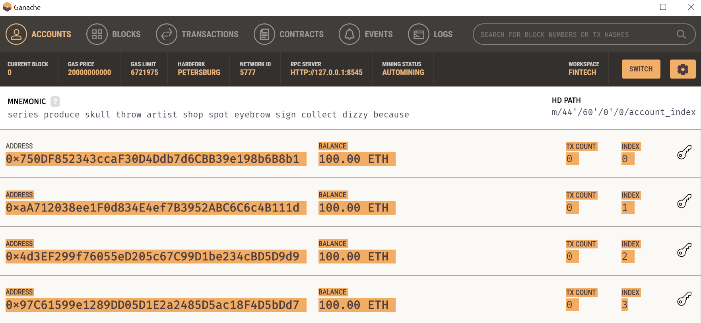

&nbsp;

When deploying the contract, ensure it is being deployed from the 'company' account.  Click on the dropdown next to deploy, and enter the 3 'employee' accounts.  Then click transact.

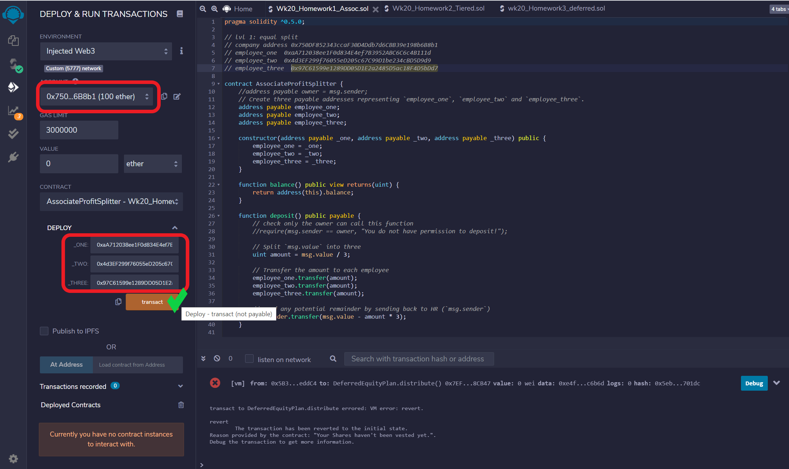

A MetaMask screen should pop up requesting confirmation of the gas fees.

&nbsp;

Once the contract has been successfully deployed, under Deployed Contracts, click on the AssociateProfitSplitter drop down.  Two buttons named deposit and balance should appear.  Clicking on the Balance button will confirm the contract start balance is zero (0).

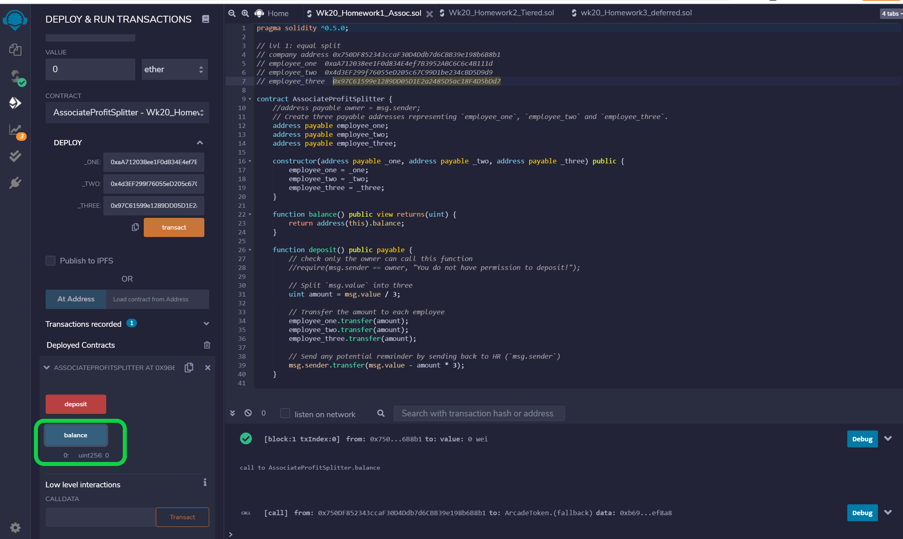

&nbsp;

Enter an amount in the value box, and click deposit.  The contract will now run and withdraw ether from the 'company' account, and distribute the ether evenly to the three employees.

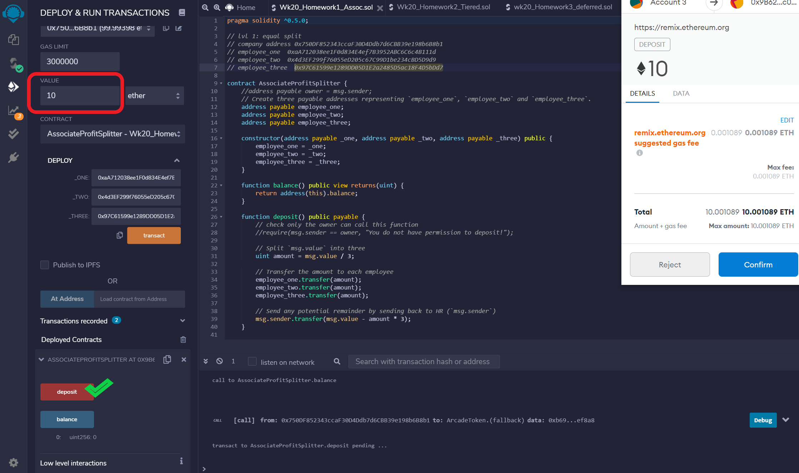

&nbsp;

The balances in the 'company' account should have decreased by slightly more than the Value amount (due to gas fees), while the three employee accounts should have increased by the same amount.  Re-clicking on the balance button will show the contract balance is again zero (0). This shows the contract is operating correctly as it should distribute all funds and not retain any value.

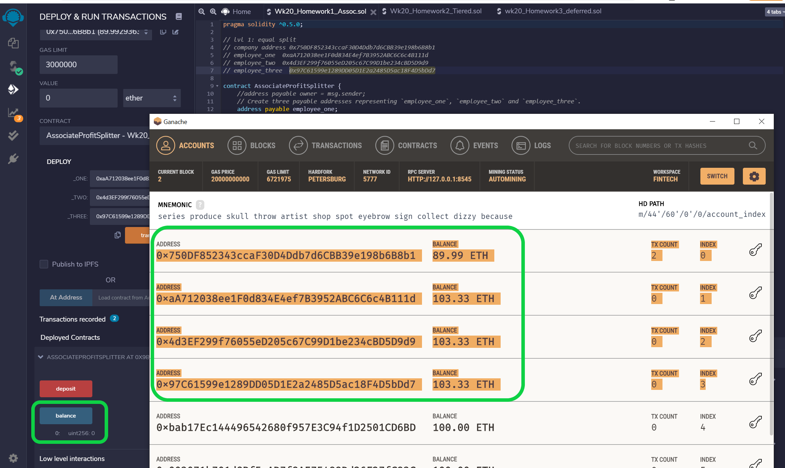

&nbsp;

### 2) Tiered Profit Splitter

Load the solidity code from the file named 'Wk20_Homework2_Tiered.sol' into Remix.

The starting balances of our 4 accounts as shown in Ganache.  For the demonstration of the Tiered Profit Splitter smart contract, the first account will be the 'company' account, while the next 3 accounts will be for the CEO, CTO & Bob, respectively.

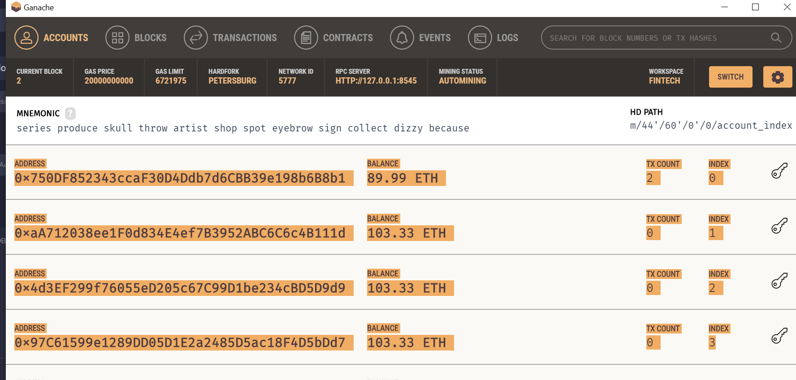

&nbsp;

To deploy the smart contract, ensure you're deploying from the appropriate address representing the 'company'.  Then click on the deploy drop down, and enter in the three addresses representing the CEO, CTO and Bob, in order respectively.  Click on transact.  A MetaMask screen should pop up requesting confirmation of the gas fees.

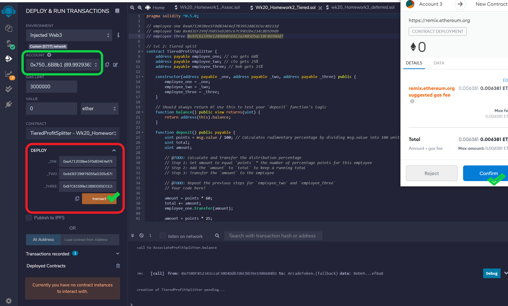

&nbsp;

Under Deployed Contracts, a TieredProfitSplitter dropdown should appear.  Click on this, and then check that the contract's balance is zero (0), by clicking the balance box.

To run the contract, enter the profit to be distributed in the value box. Then click the deposit box.  A MetaMask pop up will appear to request confirmation of the gas fees.

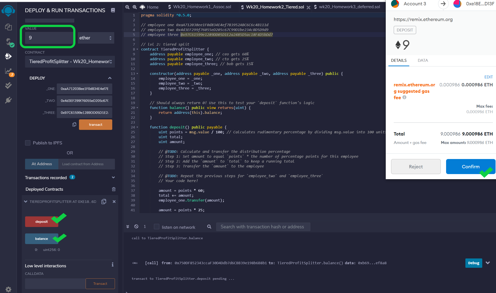

&nbsp;

In Ganache, you will be able to see the updated balances of the accounts.  

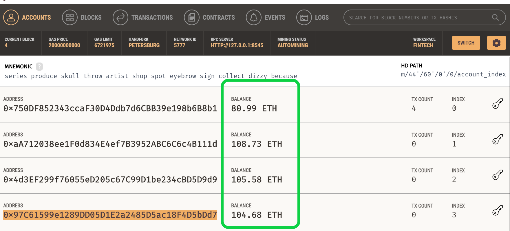

&nbsp;

In our demonstration, we entered in 9 Ether to be distributed.  Here, we have included a calculation to check that the ending balances are correct.

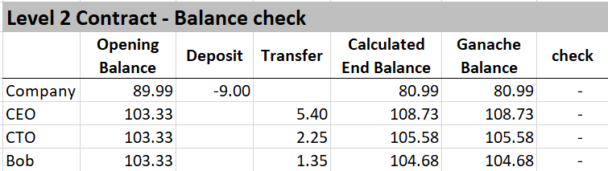

&nbsp;

In Remix, clicking on the Balance button again will confirm that the updated contract balance remains zero (0).  This is correct, as the contract is coded to distribute all Ether.

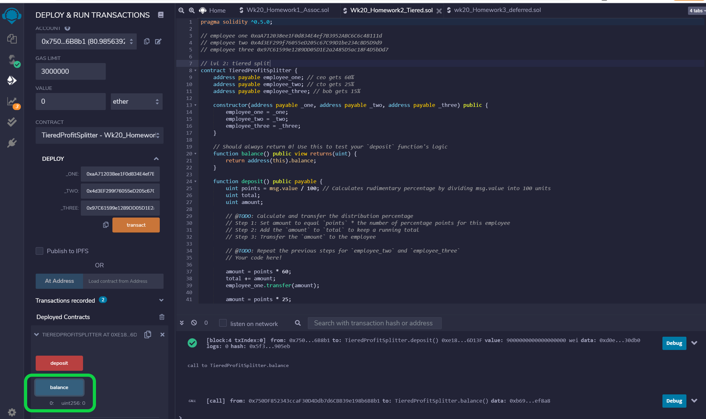

&nbsp;

### 3) Deferred Equity Plan

To demonstrate our third contract, we have set up two versions of the solidity code. One version with the actual code for real deployment.  And another version which contains a 'faketime' so that we can bring forward time and demonstrate how the contract vests Ether to the employee over the 4 year vesting period.

To demonstrate the file using fakenow version, in Remix, load the 'Wk20_Homework3_deferred_faketime.sol' file.

FYI - the actual code is in the 'Wk20_Homework3_deferred.sol' file.

To deploy this contract, enter the employee's address in the deploy box and click deploy.  MetaMask should pop up requesting confirmation of the gas fees.

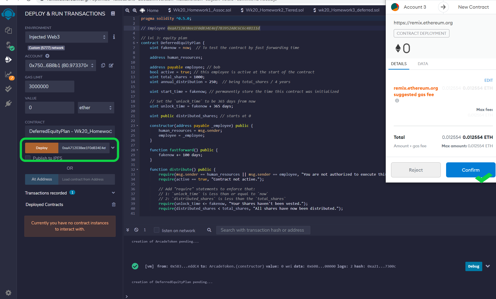

&nbsp;

Under Deployed Contracts dropdown, the DeferredEquityPlan dropdown should appear.  Click to expand.

Click on Distribute to begin the distribution process. 

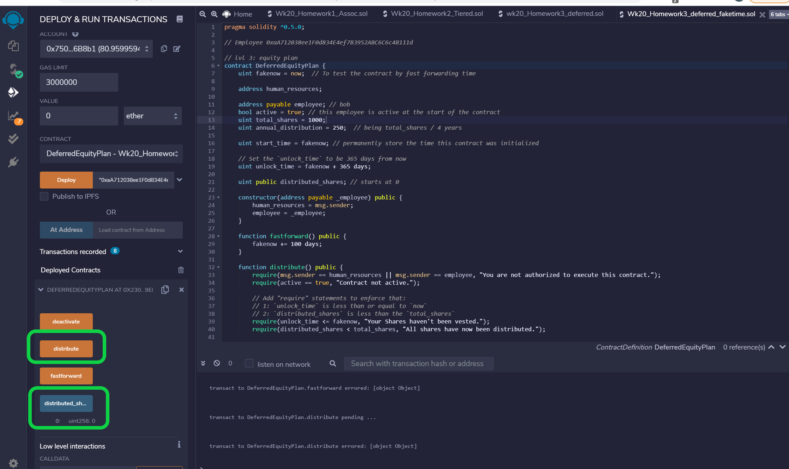

&nbsp;

Click on the 'distributed shares' button, which will show the initial balance is zero (0).

Then to bring forward time, click on the fakenow button, which brings forward time by 100 days each click.  For the first year, you'll need to click this 4 times.  After which, if you then click on the distributed shares button again, you'll see this has now changed to 250.  Repeat the process and this will increase by 250 shares each round, until we reach the maximum of 1000 shares distributed.  

Note MetaMask will seek to confirm gas fees each time fakenow or distributed shares are clicked.

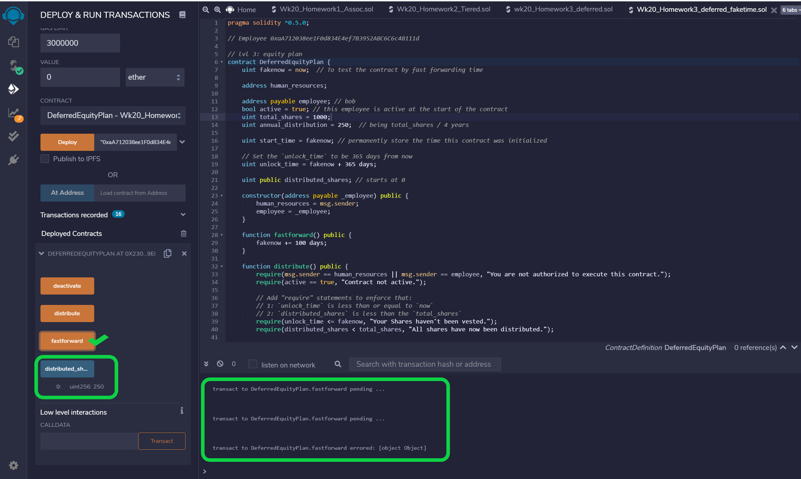

&nbsp;

-- END --
